# 小西 廉也 (Renya Konishi)

# Bio
東京科学大学 工学院機械系 2021-2025

東京科学大学大学院 工学院機械系人間医療科学技術コース 修士課程在籍中

# Skills
* **言語:**日本語、英語 (TOEFL iBT 104)、中国語
* **プログラミング:** Python, C++
* **ツール:** Unity, Quest 2, Novint Falcon, biosignalsplux

# Research Topics
#### 人間工学
軽度認知障害ドライバの認知機能低下による運転行動特性に関する研究

#### 認知心理学
絵画鑑賞における視線誘導のための聴覚情報付与が記憶に与える影響

# Projects
* VR環境における触覚制御の実装と没入感への影響検証
* お化け屋敷における体験の定量化と生体計測実験

---

# Research

### 軽度認知障害ドライバの認知機能低下による運転行動特性に関する研究

<video src="pic/49_2.mp4" width="100%" muted autoplay loop playsinline></video>

軽度認知障害（MCI）ドライバの事故低減を目指し、車線変更時の安全確認不足が生じる認知メカンズムを研究しています。MCI者は情報の「貯蔵」は可能ですが、高負荷時に情報を引き出す「想起」が困難という特性を持ちます。実車実験の結果、MCIはハンドル操作直前の「2回目の安全確認」を欠落させる傾向を突き止めました。現在はアイトラッカーでこの欠落をリアルタイム検知し、HUDやステアリングへの触覚提示で想起を物理的に補完する支援手法を構築・検証中です。人間への深い洞察に基づき、設計と実装で人の能力を拡張するUXの実現に貢献します。

**ポスター**

<object data="pic/poster.pdf" type="application/pdf" width="60%" height="500px">
    
お使いのブラウザではPDFを表示できません。 <a href="pic/poster.pdf">こちらからダウンロード</a>してご確認ください。

</object>

### 絵画鑑賞における視線誘導のための聴覚情報付与が記憶に与える影響

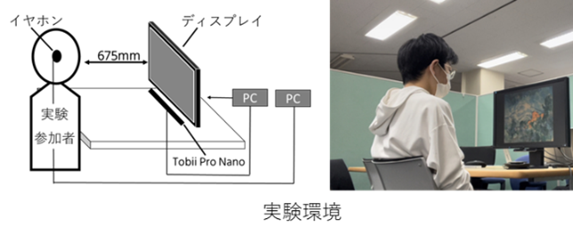 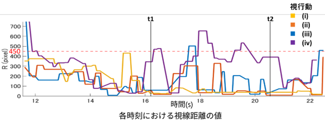
絵画鑑賞において視線を誘導するための聴覚情報（音声ガイド）が、認知処理の観点から記憶形成に与える影響を明らかにすることを目的としました。実験では、視線誘導部と情報付加部で構成される音声ガイドを用い、アイトラッカーで視線行動を計測しながら再生テスト（記憶テスト）を実施しました。分析の結果、解説対象を中心視で捉え続ける、あるいは周辺視10°以内（半径約450px）に捉える視行動が記憶定着に寄与することが示されました。特に、情報付与が終了する直前に再び対象を注視するタイミングが重要であることが判明しています。結論として、対象を注視し続け、かつ提示する意味情報の質や馴染み深さを考慮した聴覚情報設計が、記憶形成を促す上で有効であると示唆されました。

---

# Projects

### VR環境における触覚制御の実装と没入感への影響検証（2023～2024）

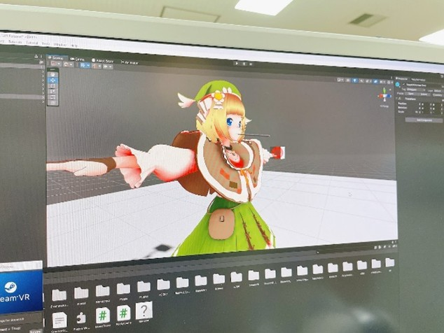 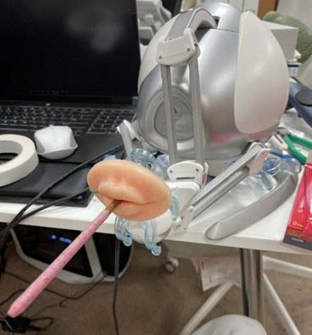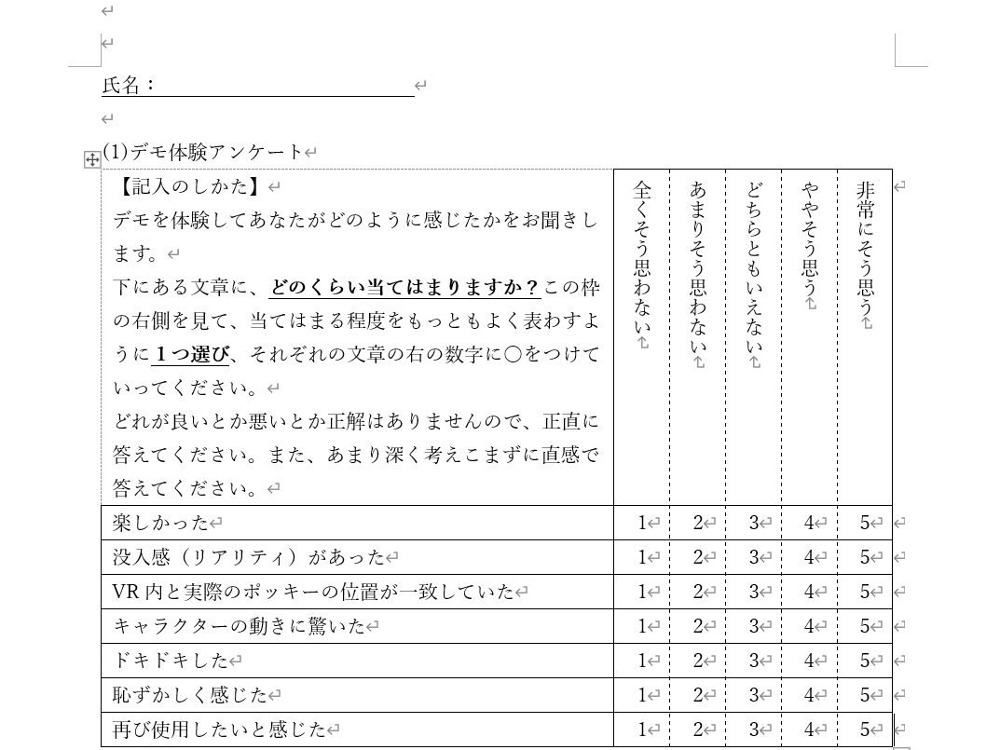
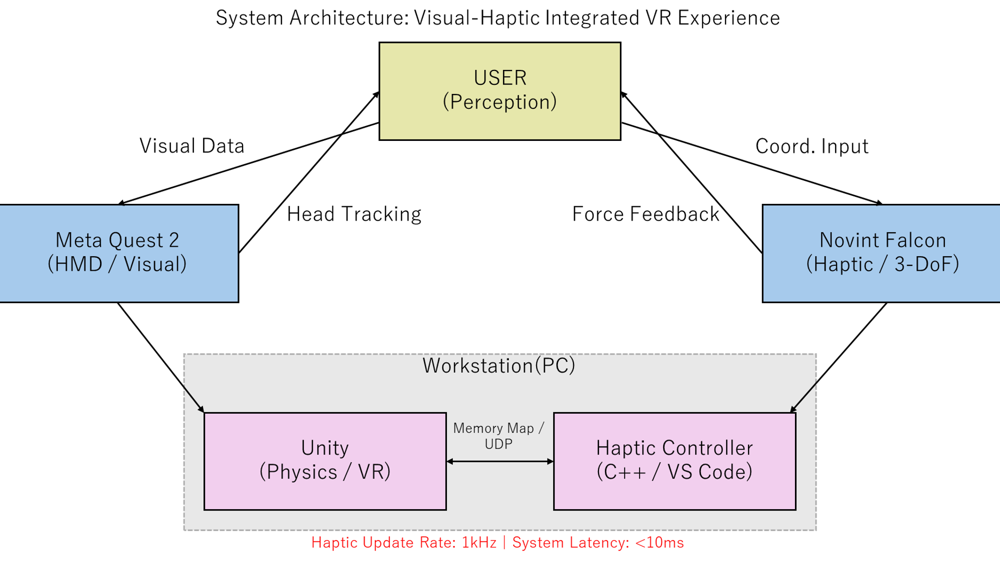

「魅せる食」という課題に対し、若者の恋愛離れという社会課題を背景としたマルチモーダルな体験設計として、VR内での疑似接触を伴うシステムの構築に挑みました。視覚情報（Quest 2）に加え、3自由度力覚デバイス（Novint Falcon）を用いて人特有の頭部の挙動を物理的に再現することで、視触覚統合による没入感の向上を図りました。C＋＋/Unityを用いたデバイス制御により、仮想空間と物理空間の座標を同期させるプロトタイプを開発しました。デモ展示を通じた簡易的なユーザー検証では、適応的挙動の実装に課題を残したものの、視触覚の提示タイミングが体験者の情動（驚きや照れ）に与える影響を確認できました。この経験から、人間の認知特性に基づいた設計から実装、検証までを一貫して行うUXデザインの基礎を体得しました。

### お化け屋敷における体験の定量化と生体計測実験

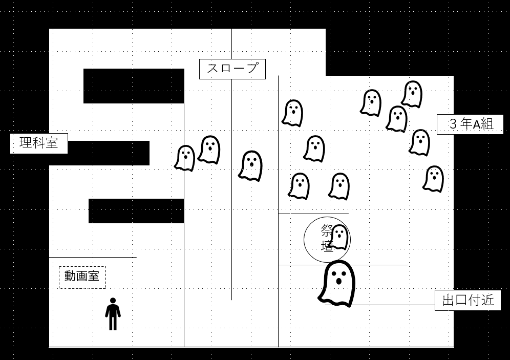 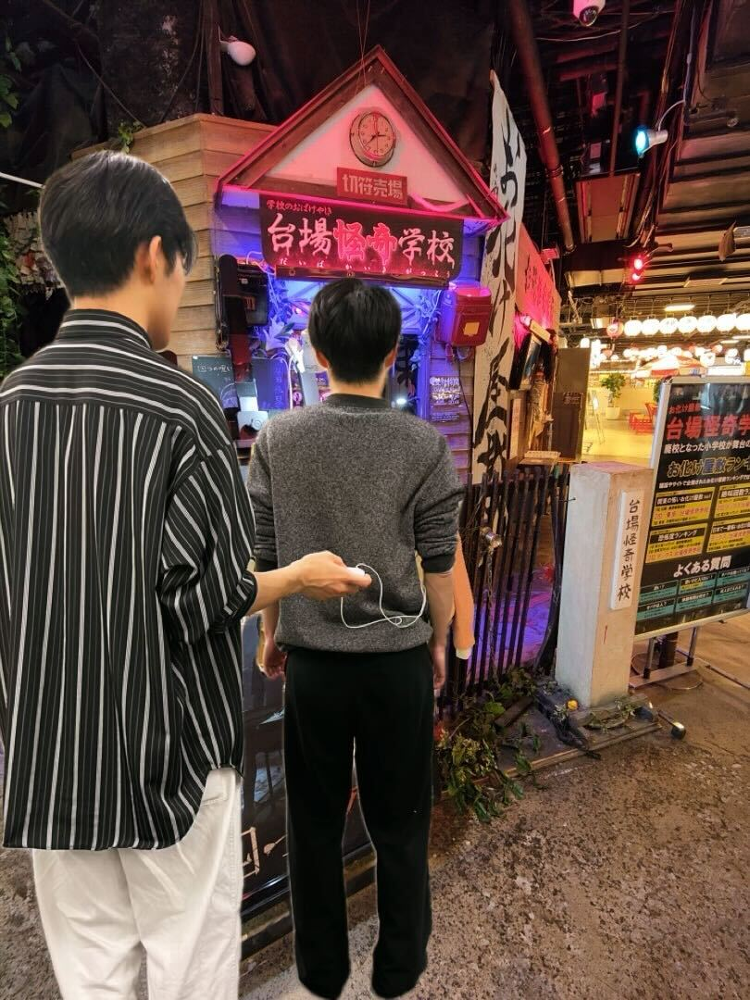
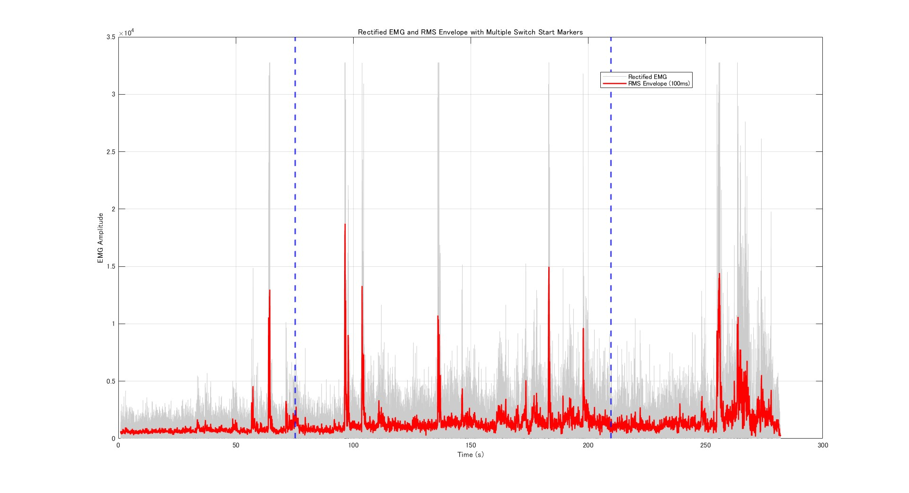

アルバイト先のお化け屋敷「お台場怪奇学校」にて、エンターテインメント体験の客観的な数値化を目指し、生体計測実験を自ら企画・実施しました。「待ち時間が恐怖体験に与える影響」をテーマに、biosignalspluxを用いて心拍数と僧帽筋の筋電位を計測し、主観評価との相関を分析しました。実験の結果、歩行ノイズの影響を受けにくい僧帽筋の活動と恐怖感に一定の相関を確認しました。また、恐怖を「学習性」と「生得性」に分類した際、待ち時間は特に後天的な予測に基づく「学習性恐怖」を増幅させる傾向を突き止めました。実現場での課題立案から計測、分析までを一貫して遂行し、感性的な体験を科学的根拠に基づき解釈する実践力を培いました。

---

# 課外活動
## 公益財団法人小山台教育財団が行う国際交流事業のボランティア
「共生と対話」を軸に、多様な背景を持つ人々が相互理解を深めるための「場」のデザインに取り組んできました

#### 地方活性化とオンライン異文化交流（2021～2022）
渡航断念という制約下で、長野県栄村と連携した「雪国文化のオンライン体験」を企画し、台湾の学生へ発信しました。物理的接触が限られる中での「状況適応型の体験設計」の重要性を学んだ経験です。

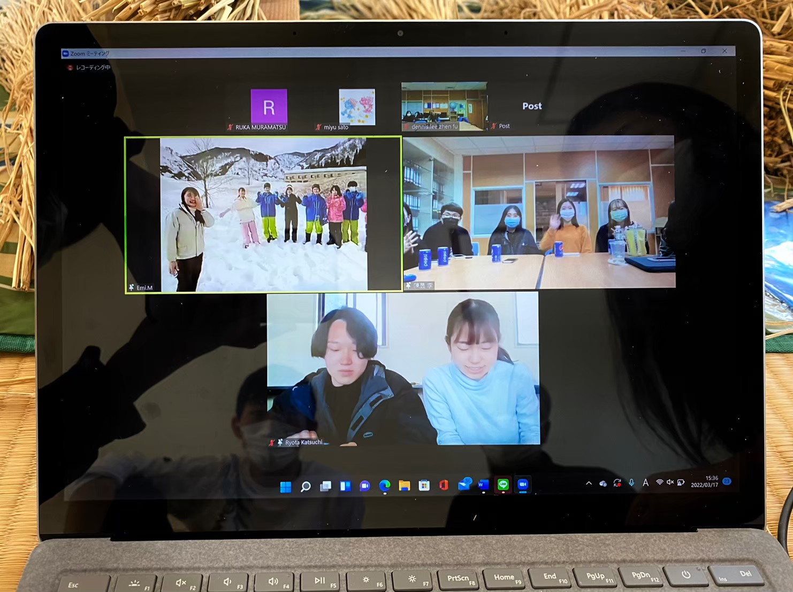

#### 国内グローバル人材育成研修の運営（2022）
国内研修のサブリーダーとして、高校生の語学力や意欲の差に配慮したファシリテーションを担当しました。個々の特性に寄り添い、学びの主体性を引き出す教育的視点を培いました。

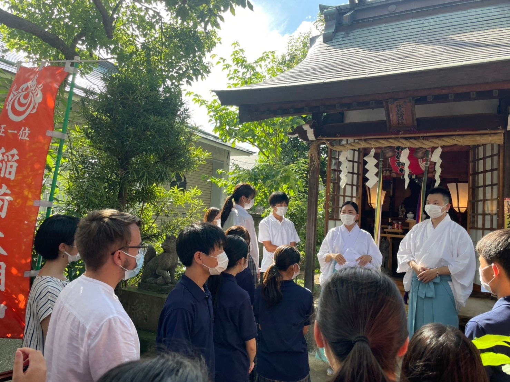

#### 第15回ドイツ交換交流派遣 大学生リーダー（2023～2024）
日独派遣のリーダーとして、多国籍な集団の相互理解を主導。集団力学を活かして本音を引き出す「心理的安全な環境」を構築しました。多様な価値観を統合し、共創を促す「場のデザイン力」の礎です。

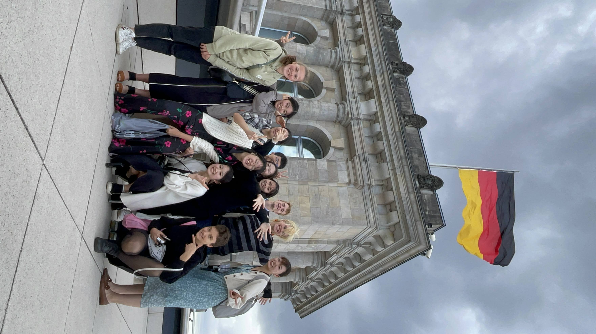 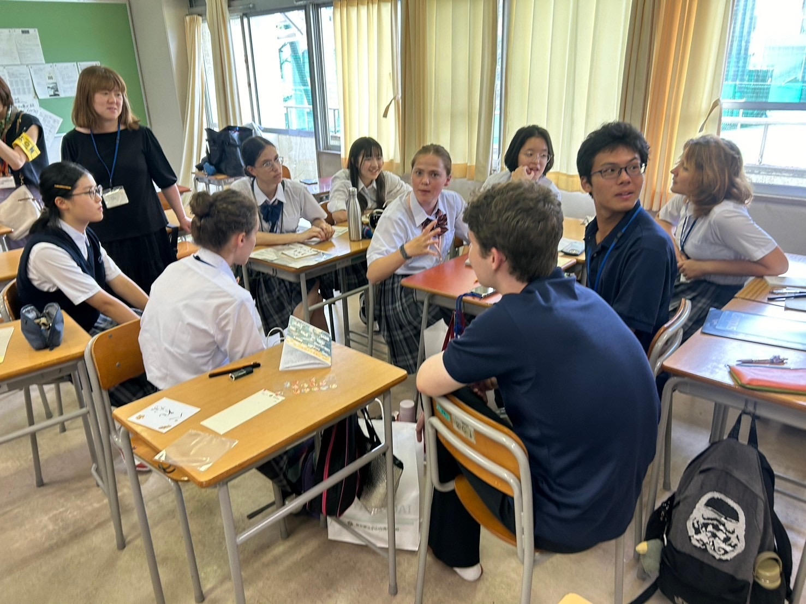
